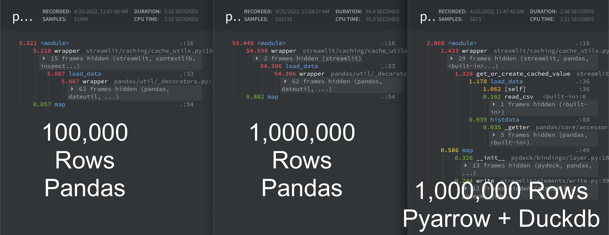

[](https://share.streamlit.io/gerardrbentley/uber-nyc-pickups-duckdb/main)

# Streamlit + DuckDB Demo: Uber Pickups in New York City

Inspired / Copied from [streamlit demo repo](https://github.com/streamlit/demo-uber-nyc-pickups)

A [Streamlit](https://streamlit.io) demo converted to utilize [DuckDB](https://duckdb.org/docs/api/python) to run data analysis faster and on more data than raw pandas.

Check out the speed up on loading data.
From left to right:

- `5.087 s`: [streamlit example (100,000 rows)](https://github.com/streamlit/demo-uber-nyc-pickups/blob/e714e117abe0a22fe159ce7b29980c566289b6d1/streamlit_app.py#L32)
- `54.306 s`: streamlit example (Full Dataset using `pd.read_csv`)
- `1.178 s`: this example (Full Dataset using `pyarrow` + `duckdb`)



(*Note:* Profiled with [pyinstrument](https://pyinstrument.readthedocs.io/en/latest/how-it-works.html), see more on the caveats / how it works in [this post](http://joerick.me/posts/2017/12/15/pyinstrument-20/))

## Analysis

*TODO:* Compare filtering and averaging midpoint with duckdb

I wrote the `load_data` function above to match what the original code does, which is **load** the data into a `Dataframe`, not just load the schema.
After it's loaded then `pandas` and `numpy` are used for some additional filtering and computation.

The real point of `duckdb` is to do your filtering and computation **before** loading all of your data into memory.

For parity with the streamlit demo `load_data` looks like:

```py
    data = duckdb.arrow(data)
    return data.arrow().to_pandas()
```

Just returning the duckdb instance will drop the time `load_data` takes to `~0.1 s`!
Then you have an in memory analysis object ready to go.

```py
    data = duckdb.arrow(data)
    return data
```

## Run this demo locally

```sh
pip install -r https://raw.githubusercontent.com/gerardrbentley/uber-nyc-pickups-duckdb/main/requirements.txt
streamlit run https://raw.githubusercontent.com/gerardrbentley/uber-nyc-pickups-duckdb/main/streamlit_app_duck.py
```

### Questions? Comments?

Please ask in the [Streamlit community](https://discuss.streamlit.io).
